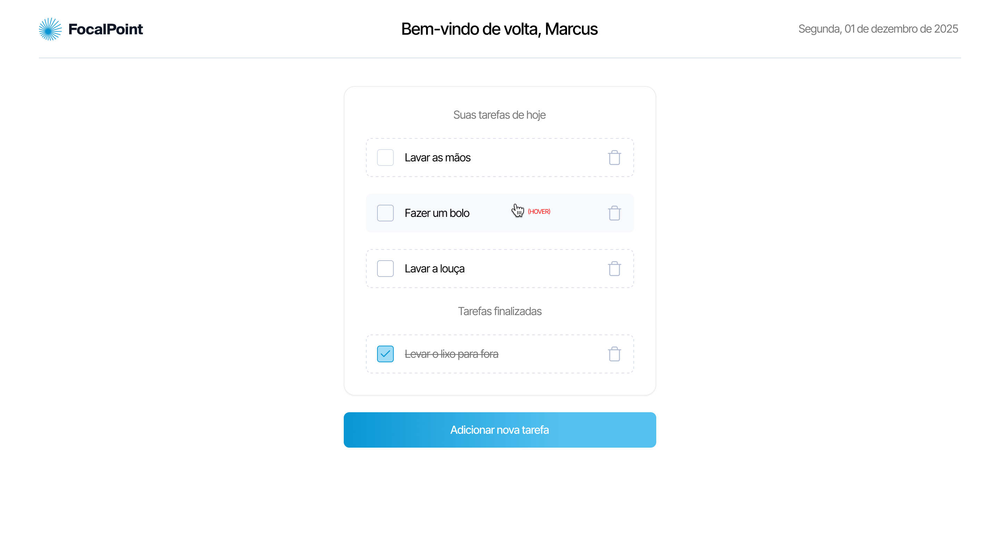

# To Do List em NextJs.

Este é um projeto de uma aplicação de lista de tarefas (Todo List) desenvolvida com Next.js e SCSS.

O objetivo é permitir a criação, visualização, conclusão e exclusão de tarefas diárias. A aplicação segue o design recebido no Figma e implementa funcionalidades de interface de usuário, gerenciamento de estado e armazenamento local.

## 🚀 Tecnologia

- ⚡ Next.js é um Framework React para renderização e roteamento.

- ⚡ JavaScript é uma linguagem de programação interpretada estruturada, de script em alto nível com tipagem dinâmica fraca e multiparadigma.

- ⚡ HTML é a linguagem base para se desenvolver qualquer site. 

- ⚡ SCSS é uma linguagem de folha de estilos que é compilada para CSS.

## ✋🏻 Pré-requisitos

- [git](https://git-scm.com/downloads): Ferramenta para gerenciar o código-fonte

- [Visual Studio Code](https://code.visualstudio.com/): Editor de Código Fonte

- [Next.js](https://nextjs.org/): Biblioteca JavaScript para criar interfaces de usuário

## :hammer_and_wrench: Antes de iniciar o projeto.

No diretório do projeto, instale as dependências e inicialize o projeto:

### `npm install`

Instala as dependências.

### `npm run dev`

Executa o aplicativo no modo de desenvolvimento.

Abra [http://localhost:3000](http://localhost:3000) para visualizá-lo em seu navegador.
