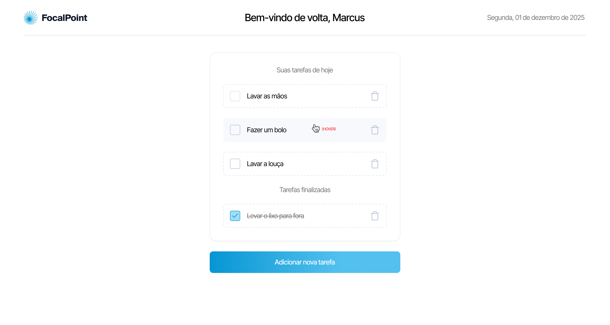

# 🌐 To Do List com Next.Js.

Aplicação de lista de tarefas (To Do List) criada com **Next.js 14 App Router**, **React**, e **SCSS**.

> 💡 Interface baseada em um design fornecido via Figma.

O objetivo é permitir a criação, visualização, conclusão e exclusão de tarefas diárias. A aplicação implementa funcionalidades de interface de usuário, gerenciamento de estado e armazenamento local.



---

## 🚀 Tecnologia

- ⚡ Next.js

- ⚡ React.js

- ⚡ SCSS é uma linguagem de folha de estilos que é compilada para CSS.

- ⚡ HTML5 + JavaScript ES6+

- 💾 `localStorage`

---

## 🧪 Funcionalidades

- ✅ Criar nova tarefa
- ✅ Marcar tarefa como concluída
- ✅ Excluir tarefa com modal de confirmação
- ✅ Exibição separada de tarefas pendentes e concluídas
- ✅ Dados persistidos localmente
- ✅ Layout limpo e responsivo

---

## 🛠️ Como executar o projeto

1. Clone o repositório:
```bash
git clone https://git@github.com:gemaquejr/nextjs-task-list.git
```
2. Instale as dependências:
```
- cd nextjs-task-list
- npm install
- npm run dev
```

Abra [http://localhost:3000](http://localhost:3000) para visualizá-lo em seu navegador.

---

Desenvolvido com ❤️ por [Francisco Gemaque](https://www.linkedin.com/in/gemaquejr/)
